 # Test Cases – SDN QoS Priority Controller

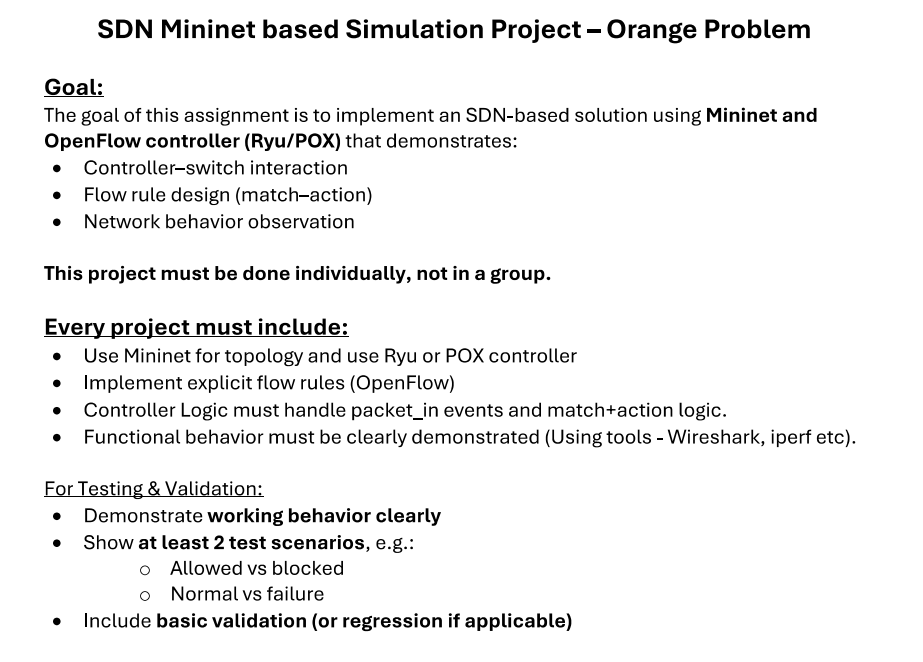
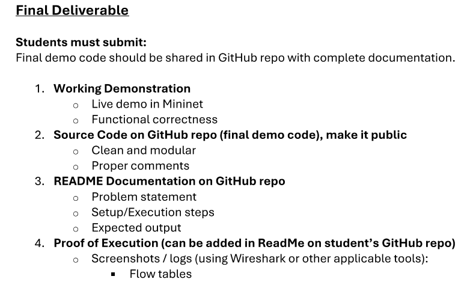

---

## Case 1: Pingall (Connectivity Check)

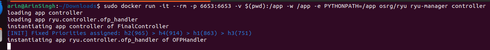
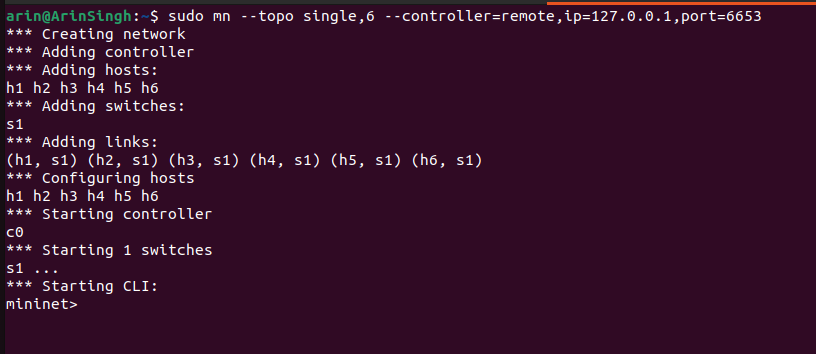
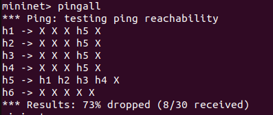
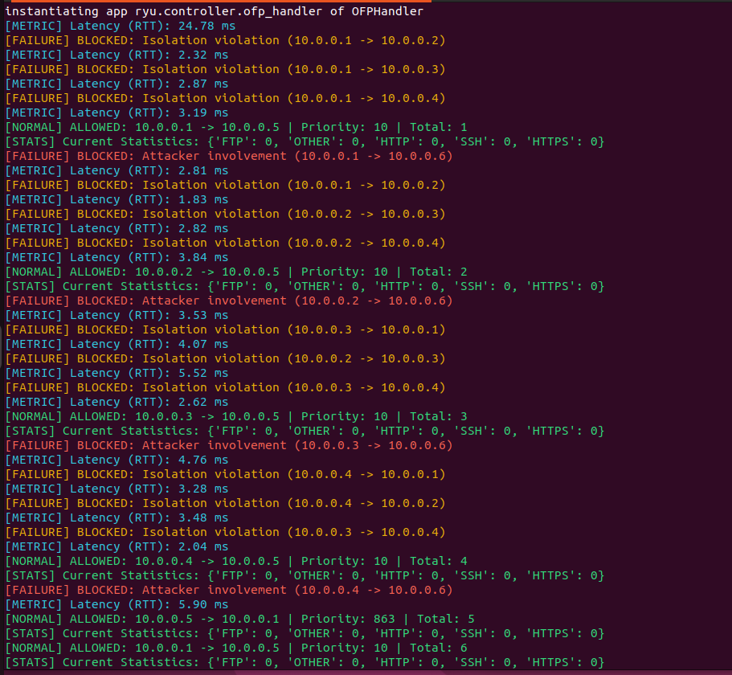
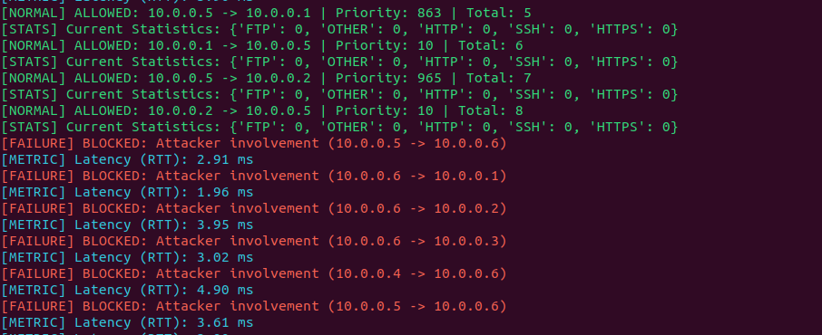

---

## Case 2: Allowed Communication (h5 → h1)

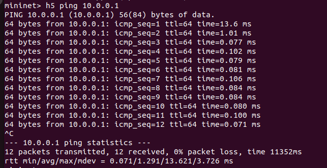

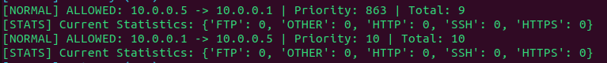

---

## Case 3: Blocked Attacker (h5 → h6)

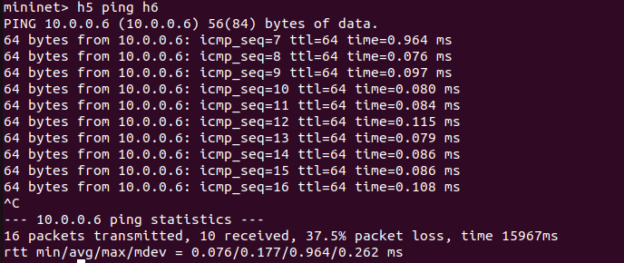

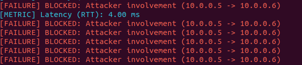

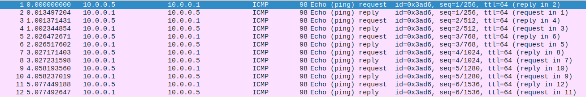

---

## Case 4: Isolation Violation (h2 → h3)

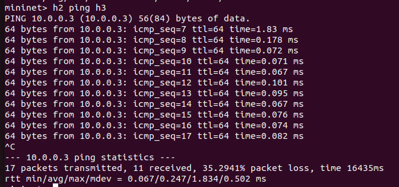

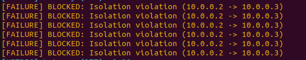

---

## Case 5: Reverse Block (h6 → h4)

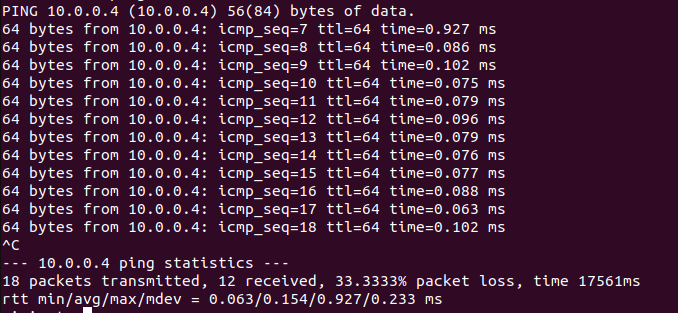

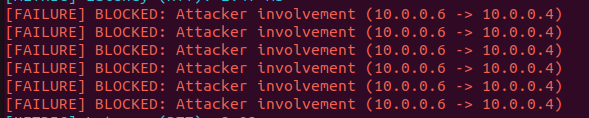

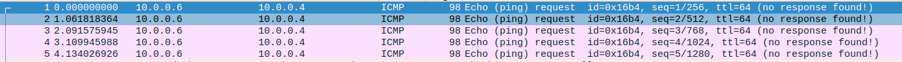

---

## Case 6: Simultaneous Requests (QoS Priority Handling)

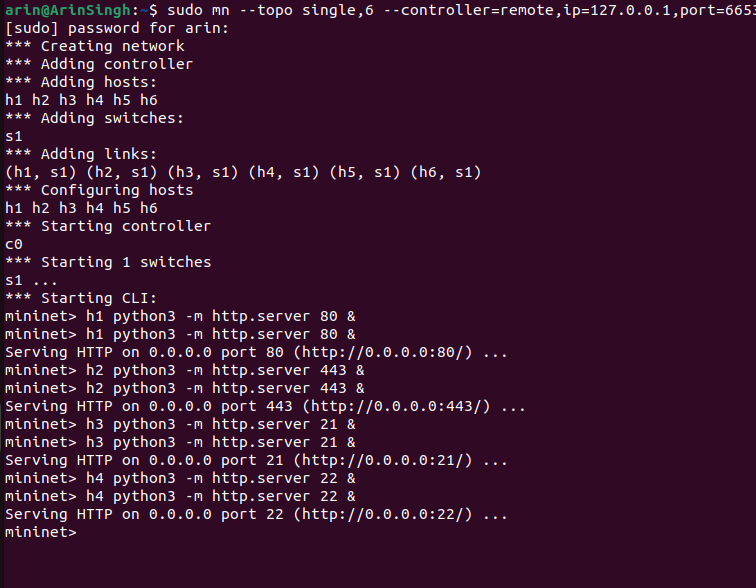

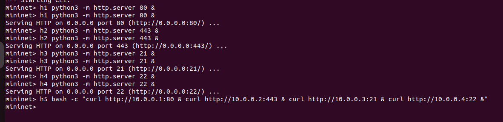

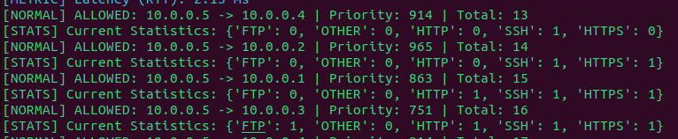

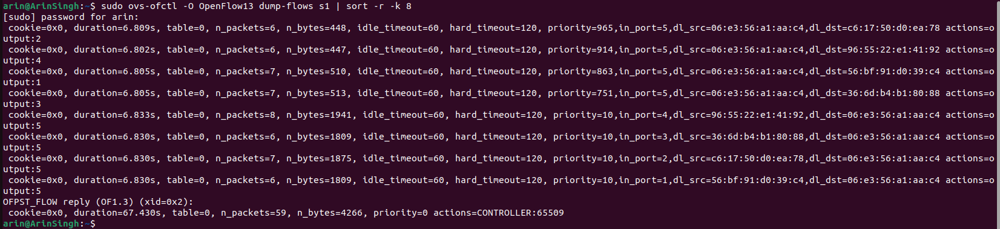

---

## Case 7: Flow Installation

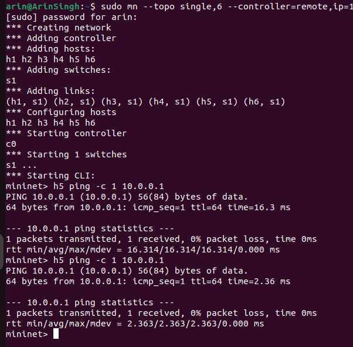

---

## Case 8: Thourghput 

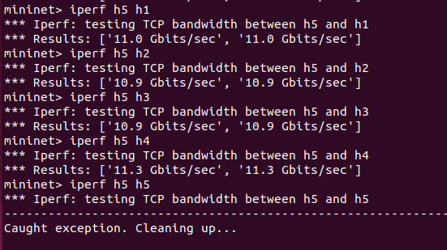
